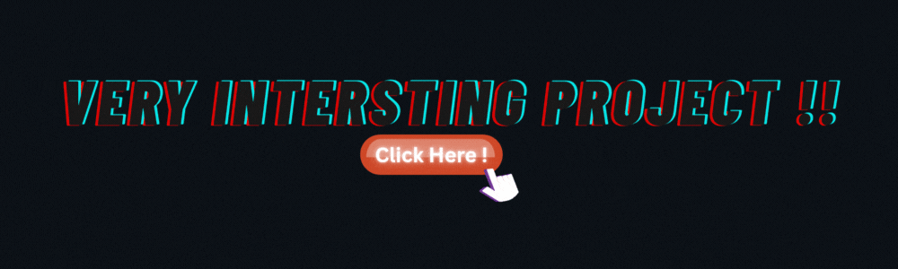

  

  

  

  

---

### 🛠️ Projects I'm Cooking Up

  

- 🧠 **FocusFusion** – A distraction-tracking Pomodoro app built to boost deep focus and productivity.  
- 🩸 **Lunara** – An AI-powered menstrual cycle tracker with mood prediction & symptom logging.

---

### 📚 Currently Learning

React, Express, MongoDB, and lowkey fighting with TypeScript 😅

---

### 📫 How to Reach Me

**Email:** singh.shreyansh1756@gmail.com

---

### ⚡ Fun Fact

🏴‍☠️ I name my variables, forget them 10 minutes later, and go on a full-blown pirate hunt to find them again 🪙🗺️☠️

---

### 🌐 Connect with Me

  
  
  
  
  

---

### 🧰 Languages & Tools

  
  
  
  
  
  
  
  
  
  
  

